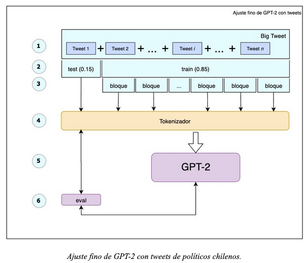
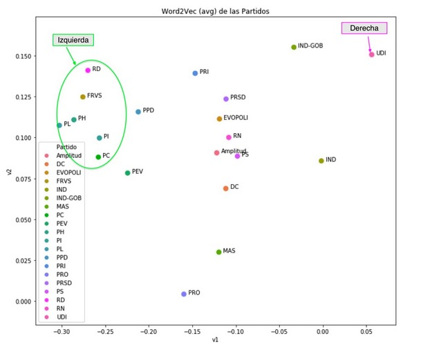

# GPT-2 Ajuste fino con tweets

Durante el desarrollo del trabajo no encontramos un modelo de lenguaje casual entrenado en español que nos permitiera realizar un ajuste fino para los tweets. A modo de experimento, nuestra primera aproximación fue realizar un ajuste fino utilizando el modelo original GPT-2 base pre-entrenado inglés. Utilizamos la base de datos de los textos en los tweets para que el modelo aprendiera de ejemplos la manera de escribir de los políticos. 

El procedimiento para ajuste fino de este modelo se representa en la siguiente imagen. 

Iniciamos concatenando todo el dataset de forma aleatoria en un gran corpus (1). Luego de dividir entre entrenamiento y pruebas (2), el set de entrenamiento se divide en partes iguales (3) que son codificadas con el tokenizador (4). Se entrenó durante 10 epoch (5) con evaluación cada 500 steps (6)

Para nuestra sorpresa, este experimento tuvo resultados positivos inmediatos. En la siguiente tabla se muestran algunos ejemplos de textos generados con el modelo base ajustado utilizando los tweets de políticos chilenos de derecha. No obstante la buena performance, si utilizamos un inicio muy pequeño el modelo genera texto que no mantiene un hilo conductor y tiene pobre redacción. Por otro lado, utilizando un comienzo más amplio (más contexto) las generaciones mejoran. 

### Notebooks con los pasos

1. [Carga de datos](1-laod-explore.ipynb)
1. [Visualizaciones](1-visualizacion.ipynb)
1. [Crea datasets derecha train / test](crea-datasets-der.ipynb)
1. [Crea datasets izquierda train / test](crea-datasets-izq.ipynb)
1. [Ajuste Fino GPT-2 con Tweets Derecha](ajuste-fino-gpt2-tweets-derecha.ipynb)
1. [Ajuste Fino GPT-2 Custom en español con Tweets Derecha](ajuste-fino-gpt2-tweets-derecha.ipynb)

## Entreamiento utilizando datasets de izquierda y derecha viendo las diferencias de los textos generados.

### Selección de Datos de Izquierda y Derecha

Para dividir el set de datos, tomamos el set de datos de tweets etiquetado con el partido político y coalición. Luego ejecutamos el siguiente procedimiento:

1. Remover stop words de los textos.
2. Generación de bag of words de 1-gram
3. Entrenamos un modelo de Word2vect con 2 dimensiones 
4. Promediamos v1 y v2 para cada partido político.
5. Visualización (siguiente figura)

Imagen de [Visualizaciones](1-visualizacion.ipynb)

Como vimos en las visualizaciones anteriormente, a nivel de vocabularios y su uso hay una diferencia entre el partido UDI y un cúmulo de partidos que podemos llamar de izquierda (RD, FRVS, PH, PL, PI y PC)

1. [Ajuste Fino GPT-2 con tweets derecha](4-train-gpt2-es-8h-512pos-toke-es-tweets-der.ipynb)
1. [Ajuste Fino GPT-2 Custom en español con Tweets Derecha](4-train-gpt2-es-8h-512pos-toke-es-tweets-izq.ipynb)

