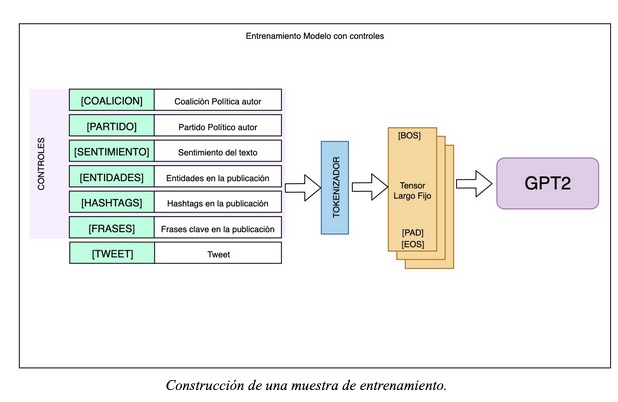

# Control fino en la generación de tweets

Un mecanismo más sofisticado para controlar la salida del texto es entregar un contexto detallado como input y esperar que el modelo aprenda las relaciones entre el texto y ese contexto. Esto perimite que el texto generado sea la respuesta a ese input. Para aumentar ese control en base a parámetros se debe modificar el dataset de entrenamiento para establecer esos controles y permitir al modelo aprender de ellos . 

## Preprocesamiento del set de datos 

Para generar los contextos, utilizamos las características ya obtenidas en el set de datos base:
* **Coalición**: Coalición política del autor de la publicación
* **Partido**: partido político al cual pertenece el autor de la publicación.
* **Sentimiento**: sentimiento extraído desde el texto con herramientas de Sentiment Analysis. 
* **Entidades**: entidades encontradas en el texto de la publicación, separadas por espacio.
* **Hashtags**: Hashtags de publicación separadas por espacio.
* **Frases**: frases clave encontradas en el texto de la publicación, separadas por espacios.
* **Tweet**: Texto de la publicación.

Los tokens especiales ([COALICION], [PARTIDO], [SENTIMIENTO], [ENTIDADES], [HASHTAGS], [FRASES], [TWEETS]) marcan el inicio del segmento correspondiente en la secuencia. Manteniendo siempre la misma estructura, el texto total (tweet + contexto) es convertido en un vector con el tokenizador. 
Verificamos el largo del vector resultante: en caso de no contar con el largo requerido por el modelo se agregan caracteres de relleno ([PAD]), por otro lado si el vector es más largo que la admitido por el modelo, el vector se trunca (primero se eliminan atributos frases clave, luego entidades y hashtags). Finalmente se le agrega el carácter de fin de secuencia ([EOS]).
Para que el modelo aprenda estas relaciones entre el contexto y la publicación es importante mantener la estructura y largo de las muestras para entrenamiento y validación. 

### Notebooks con los pasos

1. [Carga de datos](1-dataset-tweets.ipynb)
1. [Preprocesamiento de datos](2-preprocess-tweets.ipynb)
1. [Entrenamiento Contextual](3-contextual-training-v3.ipynb)
1. [Pruebas del modelo entrenado](4-test-model.ipynb)
1. [Guardado del modelo en TF](5-save-model-tf.ipynb)
